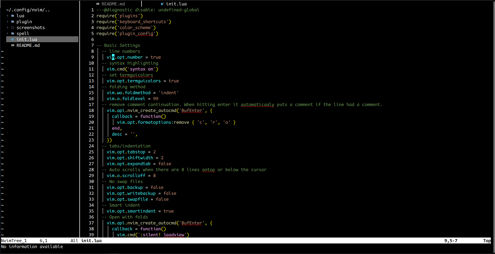
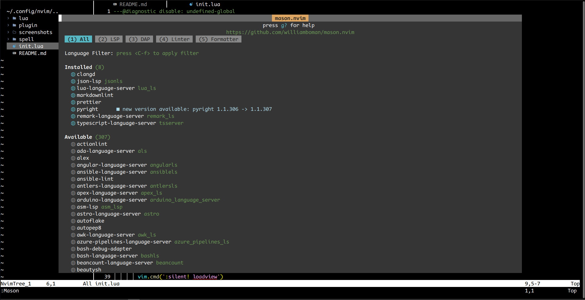

# Neovim Config

## Screenshots

## Plugins
- [nvim-web-devicons](https://github.com/nvim-tree/nvim-web-devicons)
- [nvim-tree](https://github.com/nvim-tree/nvim-tree.lua)
- [nvim-treesitter](https://github.com/nvim-treesitter/nvim-treesitter)
- [bufferline](https://github.com/akinsho/bufferline.nvim)
- [vim-bbye](https://github.com/moll/vim-bbye)
- [indent-blankline](https://github.com/lukas-reineke/indent-blankline.nvim)
- [vim-table-mode](https://github.com/dhruvasagar/vim-table-mode)
- [LanguageTool](https://github.com/vigoux/LanguageTool.nvim)
- [lsp-zero](https://github.com/VonHeikemen/lsp-zero.nvim)
    - [nvim-lspconfig](https://github.com/neovim/nvim-lspconfig)
    - [mason](https://github.com/williamboman/mason.nvim)
    - [mason-lspconfig](https://github.com/williamboman/mason-lspconfig.nvim)
    - [nvim-cmp](https://github.com/hrsh7th/nvim-cmp)
    - [cmp-nvim-lsp](https://github.com/hrsh7th/cmp-nvim-lsp)
    - [LuaSnip](https://github.com/L3MON4D3/LuaSnip)

## Shortcuts
### Movement

|                                                       |                        |
|-------------------------------------------------------|------------------------|
| Move focus to left, down, up, or right window         | ctrl + h,j,k,l         |
| When there is no buffer it doesn't allow you to move. | :q then ctrl + h,j,k,l |
| Resize window                                         | ctrl + arrow keys      |
| New terminal                                          | :term                  |
| Exit from terminal mode                               | ctrl + \ then ctrl + n |
| Move to left, or right buffer                         | shift + h,j            |

### Folding by indentation

|            |       |
|------------|-------|
| Close fold | zc    |
| Open fold  | enter |

### Spelling 

|                                   |              |
|-----------------------------------|--------------|
| Add misspelled work to dictionary | zg           |
| Temporarily turn off spelling     | :set nospell |
| See spelling suggestions          | z=           |

### Saving and Closing

|                       |          |
|-----------------------|----------|
| Save                  | :w       |
| Save and close buffer | ctrl + w |
| Close window          | :q       |
| Close buffer          | :Bd      |

### NvimTree

|                                                         |           |
|---------------------------------------------------------|-----------|
| Hide and un-hide nvimtree                               | ctrl + b  |
| Open file                                               | enter     |
| Open file in vertical split                             | ctrl + v  |
| Open file in new buffer while keeping focus in NvimTree | tab       |
| Add file/folder                                         | a         |
| Rename file/folder                                      | r         |
| Delete file/folder                                      | d         |
| Trash file/folder                                       | D         |
| Hide and unhide hidden files/folders                    | shift + h |
| Open folder as root folder                              | ctrl + ]  |
| Copy                                                    | c         |
| Cut                                                     | x         |
| Paste                                                   | p         |

### Formating

|                        |          |
|------------------------|----------|
| Turn table mode on/off | \tm      |
| Format selected text   | ctrl + f |
| Format file            | f3       |

### NvimLSP

|                                  |           |
|----------------------------------|-----------|
| Display hover info               | shift + k |
| Display function info            | gs        |
| Jump to definition               | gd        |
| Show errors/warnings             | gl        |
| move to next, prev error/warning | ],[ + d   |
| See code actions                 | f4        |
| Rename all references            | f3        |

### Autocompletion

|                   |          |
|-------------------|----------|
| Confirm selection | ctrl + y |
| Cancel completion | ctrl + e |
| Next completion   | ctrl + n |
| Prev completion   | ctrl + p |
